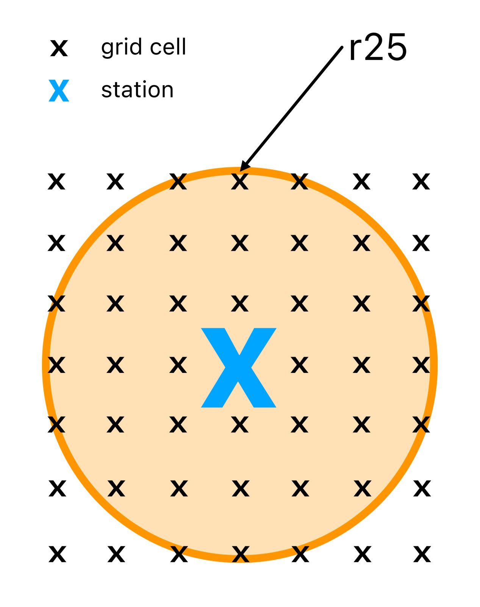

# DAISE Framework
<a name="readme-top"></a>

[![GitHub][GitHub-shield]][GitHub-url]
[![LinkedIn][linkedin-shield]][linkedin-url]

<!-- TABLE OF CONTENTS -->
<details>
  <summary>Table of Contents</summary>
  <ol>
    <li><a href="#about-the-project">About The Project</a></li>
    <li><a href="#methodology">Methodology</a></li>
      <ul>
        <li><a href="#spatial-analysis">Spatial Analysis</a></li>
      </ul>
      <ul>
        <li><a href="#temporal-analysis">Temporal analysis</a></li>
      </ul>
    <li><a href="#results">Results</a></li>
      <ul>
        <li><a href="#spatial-analysis">Spatial Analysis Results - Deviation Heat Map</a></li>
      </ul>
      <ul>
        <li><a href="#temporal-analysis">Spatial Analysis Results - Ring Metrics</a></li>
      </ul>
      <ul>
        <li><a href="#spatial-analysis">Temporal Analysis Results</a></li>
      </ul>
    <li><a href="#usage">Usage</a></li>
    <li><a href="#References">References</a></li>
    <li><a href="#contact">Contact</a></li>
  </ol>
</details>

## About the project 
Access to reliable and widespread wind speed data is a key-requirement
for a variety of use-cases in the renewable energy industry, including planning of new wind parks and forecasting methods used
for energy trading, grid stability measurements and maintenance
scheduling. While weather stations provide highly accurate measurements for specific locations, gridded datasets cover
large regions, where data from weather stations might not be available. This study contributes towards understanding the reliability and utility of gridded wind speed data and provides a reference
framework for comparing them to sparse weather station datasets. The analysis focuses on a subset of diverse regions within
Germany.

## Methodology
We divide our comparative analysis between the station dataset and the gridded dataset into a spatial and a temporal analysis.

### Spatial Analysis
The spatial analysis is split into a local visual inspection, where we analyze the immediate area around a station using a heat map,
and a comparative analysis, where we define a deviation metric for a specific station and radius so that we can analyze how the
deviations for the different stations change with distance and angle from the station.
In order to calculate the difference between two different wind speed data sources over a given period of
time - in our case, the difference between the measurements at a weather station and the reference value at a near grid point - we
resort to the classical and frequently used root mean squared error (RMSE) and mean absolute percentage error (MAPE)

<div style="text-align:center">


</div>

### Temporal analysis
The spatial analysis ignores changes in deviation over time, since we take the mean over the time dimension to get one value that
allows for comparisons between rings with different radiuses or
different stations. In order to perform a temporal analysis of the deviation between a station and the grid points in the surrounding
region, we calculate the RMSE and MAPE for every time step t. Then, we perform a seasonal
trend decomposition (STL) for the 𝑅𝑀𝑆𝐸𝑡 and 𝑀𝐴𝑃𝐸𝑡 to check for possible seasonal effects in the deviation between the station
measurements and the surrounding grid points.


## Results

### Spatial Analysis Results - Deviation Heat Map
<div style="text-align:center">


</div>

Based on the visualizations of the 4 stations it can be said that the values of the grid points are quite different from the station values and that the mean RMSE
differs significantly between the stations. Furthermore, at least according to the heat map it does not seem to make a difference how far a
grid point is away from the station. This would indicate that a grid point close to the actual station represents the station’s measurement just as good as a grid point
which is 20 kilometer or more away from the station.

<div style="text-align:center"></div>

The region around Cuxhaven lies directly on the sea with no notable elevations. Both the RM-
SEs and MAPEs for Cuxhaven are similarly homogeneous to the topography. Mannheim is also rather flat; only the foothills of the
Vosges (left) and the Black Forest (right) can be seen just outside the 25 kilometer radius. At least in the deviation heat map, these
mountains do not seem to have any influence on the deviations in the 25 kilometer radius. The situation is different for the stations at
the Brocken and in Munich. At Brocken, there seems to be much smaller deviations (6 m/s vs 8-10 m/s RMSE) at the edge parallel to
the valley (in the upper right map section). At the Munich station, on the other hand, the two alpine foothills seem to correlate with a
significantly higher deviation (2-4 m/s vs almost 10 m/s RMSE).

### Spatial Analysis Results - Ring Metrics
<div style="text-align:center">

</div>

Neither the mean of the RMSE nor of the MAPE indicate that there is a clear correlation between
deviation and increasing distance to the station. Especially the mean RMSE of the stations seem to be almost constant for different
distances. For Mannheim and München, RMSE is almost constant at around 1.5 m/s and Cuxhaven lays slightly above with around 3
m/s. Brocken RMSE is also constant with radius, but at a significant higher level of around 10 m/s.
The standard deviation of the RMSE of the station at Broken makes a larger jump at about five kilometers. Overall, the RMSE
standard deviation at the Broken station for the entire 50 kilometer is higher by about the magnitude by which the mean also differs
from that of the other station. This spike in the standard deviation at about 5 kilometers from the Broken station could indicate a change
in topography, so that the RMSE in the ring deviates more from the mean here.

### Temporal Analysis Results
<div style="text-align:center">

</div>

The STL shows besides from smaller short term trends, no long-term changes in the data. Multiple short term trends of up to six month (market purple), do not form a clear
pattern. The trend over a longer period of time can be described as neutral. Based on the trend component, our analysis cannot confirm a clear longterm increase or decrease of deviations between
the station measurement and surrounding grid reference values. Short term trend could be a result of temporary climate phenomena.
With regard to seasonality, the following observations can be made: Around the months to each turn of the year a strong seasonal recurrence can be observed (red). The same recurring event can also
be recognized at some mid-year points (green). It can be assumed that the increasing deviations to the station that appear around
that months of the year can be explained by the characteristics of
the winter and summer months in Germany.

### Built With
* [![Pandas][Pandas-logo]][Pandas-url]
* [![Numpy][Numpy-logo]][Numpy-url]
* [![Xarray][Xarray-logo]][Xarray-url]

* [![Sqlite3][Sqlite3-logo]][Sqlite3-url]
* [![Matplotlib][Matplotlib-logo]][Numpy-url]
* [![scikit-lean][scikit-lean-logo]][scikit-lean-url]


## Usage
```
Usage: main.py [OPTIONS]

Options:

```
## References


## Contact
Feel free to contact me via LinkedIn:

[![LinkedIn][linkedin-shield]][linkedin-url]

<!-- MARKDOWN LINKS & IMAGES -->
[Pandas-logo]: https://img.shields.io/badge/pandas-0d6efd?style=for-the-badge&logo=pandas&logoColor=white
[Pandas-url]: https://pandas.pydata.org/
[Numpy-logo]: https://img.shields.io/badge/NumPy-cccccc?style=for-the-badge&logo=numpy&logoColor=013243
[Numpy-url]: https://numpy.org/
[Xarray-logo]: https://img.shields.io/badge/xarray-0d6ef?style=for-the-badge&logo=pandas&logoColor=black
[Xarray-url]: https://docs.xarray.dev/en/stable/
[Sqlite3-logo]: https://img.shields.io/badge/SQLite3-044a64?style=for-the-badge&logo=sqlite&logoColor=0d6efd
[Sqlite3-url]: https://www.sqlite.org/index.html
[Matplotlib-logo]: https://img.shields.io/badge/matplotlib-cccccc?style=for-the-badge&logo=matplot&logoColor=0d6efd
[Matplotlib-url]: https://matplotlib.org/
[scikit-lean-logo]: https://img.shields.io/badge/scikit--learn-f66?style=for-the-badge&logo=scikitlearn&logoColor=black
[scikit-lean-url]: https://scikit-learn.org/stable/

[linkedin-shield]: https://img.shields.io/badge/-LinkedIn-black.svg?style=for-the-badge&logo=linkedin&colorB=378fe9
[linkedin-url]: https://www.linkedin.com/in/jan-erik-bosenius-a9a589217/
[GitHub-shield]: https://img.shields.io/badge/github-000?style=for-the-badge&logo=github&colorB=24292f
[GitHub-url]: https://github.com/Jan0412
